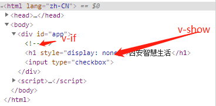

# v-show 与 v-if 区别

## 笔记

v-if 不为 true 时，直接删除 dom 元素  
v-show 不为 true 是，元素还在只是加了 display：none  
v-if 功能性强于 v-show，v-show 性能强于 v-if  
<zj style="color:orange">总结：能用 v-show 就不要用 v-if 了</zj>



### 代码

```html
<body>
  <div id="app">
    <h1 v-if="status">西安智慧生活</h1>
    <h1 v-show="status">西安智慧生活</h1>
    <input v-model="status" type="checkbox" />
  </div>

  <script>
    var vm = new Vue({
      el: "#app",
      data: {
        status: true
      },
      methods: {}
    });
  </script>
</body>
```

### [查看效果](14.html "内容展示")

### [返回](../index.html)
