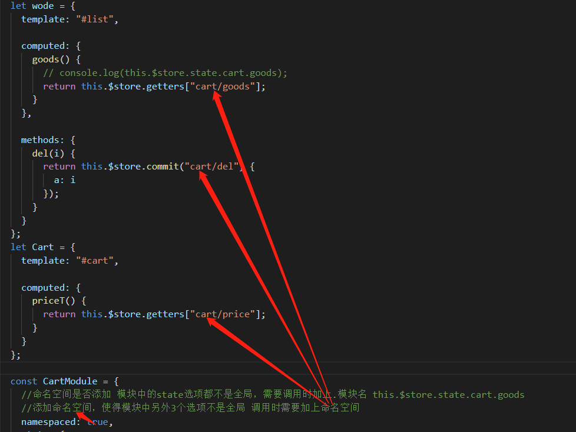

# modules 模块化开发

## 笔记

数据很多时，不同的数据用不同的模块进行管理，便于维护开发

声明模块后，模块中的 state 选项不是全局

添加命名空间，使得模块中另外 3 个选项不是全局 调用时需要加上命名空间



### 代码

```html
<!DOCTYPE html>
<html lang="zh-CN">
  <head>
    <meta charset="UTF-8" />
    <title>Document</title>
    <script src="vue.js"></script>
    <script src="vuex.js"></script>
    <script src="axios.min.js"></script>
  </head>

  <body>
    <div id="app">
      <wode></wode>
      <cart></cart>
    </div>

    <script type="text/x-template" id="list">
      <div>
        <h1 v-if="goods.length == 0"> 购物车空空如也</h1>
        <div v-if="goods.length >0">
        <h1>购物车</h1>
        <table border="1" width="60%">
          <tr>
            <th>编号</th>
            <th>名称</th>
            <th>价格</th>
            <th>数量</th>
            <th>总计</th>
            <th>操作</th>
          </tr>
          <tr v-for="v in goods">
              <td>{{v.id}}</td>
              <td>{{v.title}}</td>
              <td>{{v.price}}</td>
              <td>
                <input v-model="v.num" type="text"/>
              </td>
              <td>{{v.total}}</td>
              <td>
                <button @click="del(v.id)">删除</button>
              </td>
          </tr>
          </table>
        </div>

      </div>
    </script>

    <script type="text/x-template" id="cart">
      <div   class="cart">
        <div v-if="priceT > 0">
              <h2>总价：{{ priceT }}</h2>
            </div>
            </div>
    </script>
    <style>
      .cart {
        color: red;
        background-color: aqua;
      }
    </style>

    <script>
      let wode = {
        template: "#list",

        computed: {
          goods() {
            // console.log(this.$store.state.cart.goods);
            return this.$store.getters["cart/goods"];
          }
        },

        methods: {
          del(i) {
            return this.$store.commit("cart/del", {
              a: i
            });
          }
        }
      };
      let Cart = {
        template: "#cart",

        computed: {
          priceT() {
            return this.$store.getters["cart/price"];
          }
        }
      };

      const CartModule = {
        //命名空间是否添加 模块中的state选项都不是全局，需要调用时加上.模块名 this.$store.state.cart.goods
        //添加命名空间，使得模块中另外3个选项不是全局 调用时需要加上命名空间
        namespaced: true,
        state: {
          goods: [{ id: 12 }]
        },
        getters: {
          price: www => {
            let a = 0;
            www.goods.forEach(v => {
              a += v.num * v.price;
            });
            return a;
          },

          goods(a) {
            let goods = a.goods;
            goods.forEach(v => {
              v.total = v.num * v.price;
            });
            return goods;
          }
        },

        mutations: {
          del(state, param) {
            let k;
            for (let i = 0; i < state.goods.length; i++) {
              if (state.goods[i].id == param.id) {
                k = i;
                break;
              }
            }
            state.goods.splice(k, 1);
          },
          //1 改变仓库中的数据的方法
          setData(state, param) {
            state.goods = param.goods;
          }
        },
        //2 actions 借用axios发异步请求数据
        actions: {
          loadGoods(store) {
            axios.get("73.php").then(a => {
              //3 调用mutations里的方法改变仓库中的数据
              store.commit("setData", { goods: a.data });
              console.log(a);
            });
          }
        }
      };

      let store = new Vuex.Store({
        modules: {
          cart: CartModule
        }
      });
      var vm = new Vue({
        el: "#app",
        data: {},

        components: {
          wode,
          Cart
        },
        //4 直接在根组件用.dispatch触发actions里的方法，
        mounted() {
          this.$store.dispatch("cart/loadGoods");
        },
        store,

        methods: {}
      });
    </script>
  </body>
</html>
```

```js
```

### [查看效果](74.html "内容展示")

### [返回](../index.html)
